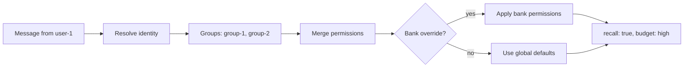
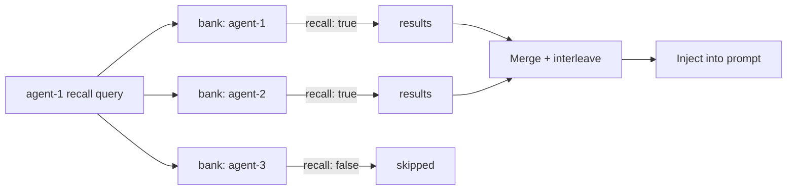
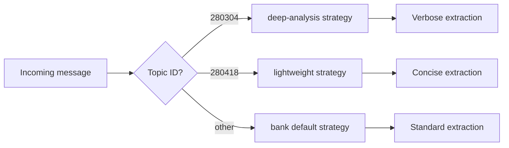
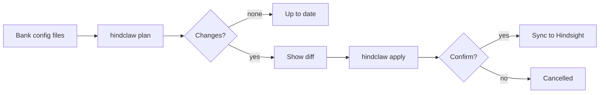
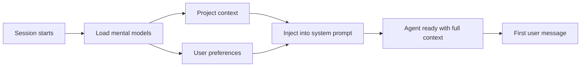
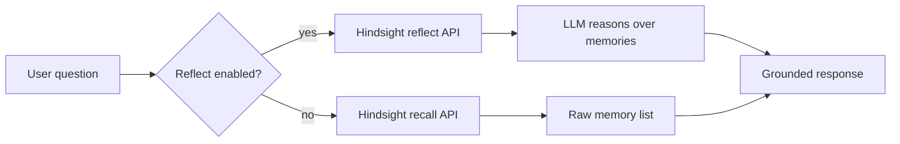
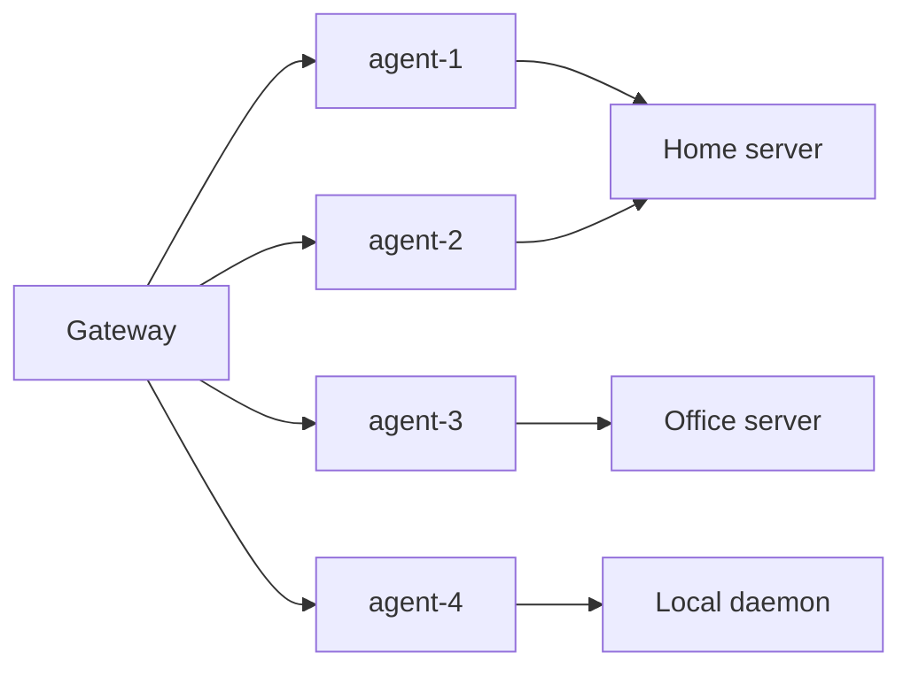
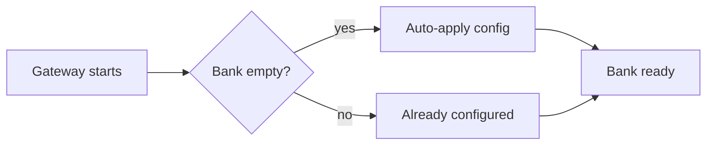

<p align="center">
  
</p>

<p align="center">
  Production memory for OpenClaw agent fleets — per-user access control, cross-agent recall, and infrastructure-as-code bank management. Powered by Hindsight.
</p>

<p align="center">
  <a href="https://www.npmjs.com/package/hindclaw"></a>
  
  
</p>

<p align="center">
  <a href="docs/">Documentation</a> &middot;
  <a href="https://hindsight.vectorize.io">Hindsight</a> &middot;
  <a href="https://openclaw.ai">OpenClaw</a>
</p>

---

## Why HindClaw?

Built on [Hindsight](https://hindsight.vectorize.io) — the highest-scoring agent memory system on the [LongMemEval benchmark](https://vectorize.io/#:~:text=The%20New%20Leader%20in%20Agent%20Memory).

The official Hindsight plugin gives you auto-capture and auto-recall. HindClaw adds what you need to run it in production:

### Per-User Access Control

RBAC for agent memory. Users inherit permissions from groups, banks override per-role.



### Cross-Agent Recall

One agent queries multiple banks in parallel. Permissions checked per-bank.



### Named Retain Strategies

Different conversation topics routed to different extraction strategies.



### Infrastructure as Code

`hindclaw plan` shows what will change. `hindclaw apply` syncs it. Like Terraform for memory banks.



### Session Start Context

Mental models loaded before the first message — no cold start.



### Reflect on Recall

Instead of raw memory retrieval, the agent reasons over its memories.



### Multi-Server Support

Per-agent infrastructure routing — one gateway, multiple Hindsight servers.



### Zero-Config Bootstrap

Set `bootstrap: true` and start the gateway. Bank configs applied automatically on first run.



---

## Quick Start

### 1. Install

```bash
openclaw plugins install hindclaw
```

### 2. Configure

Add to your `openclaw.json` (or a `$include`'d config file):

```json5
{
  "plugins": {
    "entries": {
      "hindclaw": {
        "enabled": true,
        "config": {
          "dynamicBankGranularity": ["agent"],
          "bootstrap": true
        }
      }
    }
  }
}
```

### 3. Start

```bash
openclaw gateway
```

That's it — memories are captured and recalled automatically.
The plugin starts a local Hindsight daemon on first run (requires Python 3.11+ and `uv`).

> For bank configs, access control, strategies, and multi-server setups, see the [full documentation](docs/).

---

## Features

### Bank Management

Define agent memory banks as JSON5 files — missions, entity labels, directives, dispositions. All version-controlled.

```bash
hindclaw plan --all     # preview changes
hindclaw apply --all    # sync to Hindsight
hindclaw import --agent agent-1 --output ./banks/agent-1.json5
```

See [CLI Reference](docs/cli.md).

### Access Control

Users, groups, and bank-level permission overrides. Tag-based recall filtering with Hindsight's `tag_groups` API (AND/OR/NOT boolean logic).

```json5
// groups/group-1.json5
{
  "displayName": "Executive",
  "members": ["user-1"],
  "recall": true,
  "retain": true,
  "recallBudget": "high",
  "recallTagGroups": null  // no filter — sees everything
}
```

See [Access Control](docs/access-control.md).

### Named Strategies

Route different conversation topics to different extraction strategies:

```json5
// In bank config
{
  "retain": {
    "strategies": {
      "deep-analysis": { "topics": ["280304"] },
      "lightweight":   { "topics": ["280418"] }
    }
  }
}
```

See [Bank Configuration](docs/bank-config.md).

### Cross-Agent Recall

An agent can recall from multiple banks. Permissions are checked per-bank — no unauthorized cross-reads.

```json5
{
  "recallFrom": ["agent-1", "agent-2", "agent-3"],
  "recallBudget": "high"
}
```

See [Configuration](docs/configuration.md).

---

## Documentation

| Guide | Description |
|-------|-------------|
| [Configuration](docs/configuration.md) | Plugin config, behavioral defaults, per-agent overrides |
| [Bank Configuration](docs/bank-config.md) | Missions, entity labels, strategies, `$include` directives |
| [Access Control](docs/access-control.md) | Users, groups, permissions, resolution algorithm |
| [CLI Reference](docs/cli.md) | `hindclaw plan`, `apply`, `import`, `init` |
| [Development](docs/development.md) | Building, testing, contributing |

---

## Migration from @vectorize-io/hindsight-openclaw

```bash
openclaw plugins remove @vectorize-io/hindsight-openclaw
openclaw plugins install hindclaw
```

Bank ID scheme is compatible — existing memories are preserved.
All plugin-level options use the same names, including `bankMission`.
Per-agent bank config files use `retain_mission` for the same purpose (server-side field name).

---

## Links

- [Hindsight](https://hindsight.vectorize.io) — the memory engine
- [OpenClaw](https://openclaw.ai) — the agent framework
- [GitHub](https://github.com/mrkhachaturov/hindsight-openclaw-pro)

## License

MIT — see [LICENSE](LICENSE)

Based on [`@vectorize-io/hindsight-openclaw`](https://github.com/vectorize-io/hindsight/tree/main/hindsight-integrations/openclaw) (MIT, Copyright (c) 2025 Vectorize AI, Inc.)
