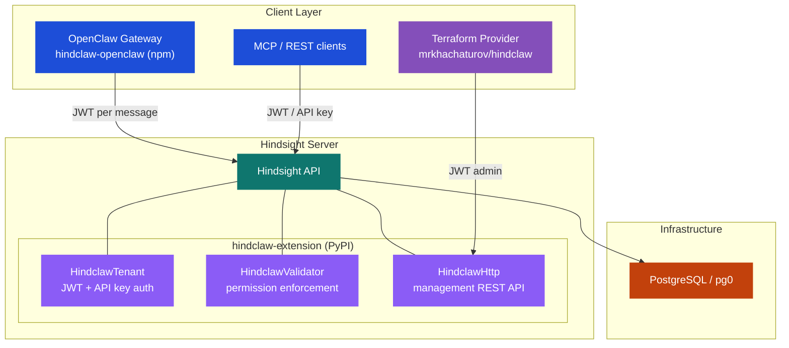
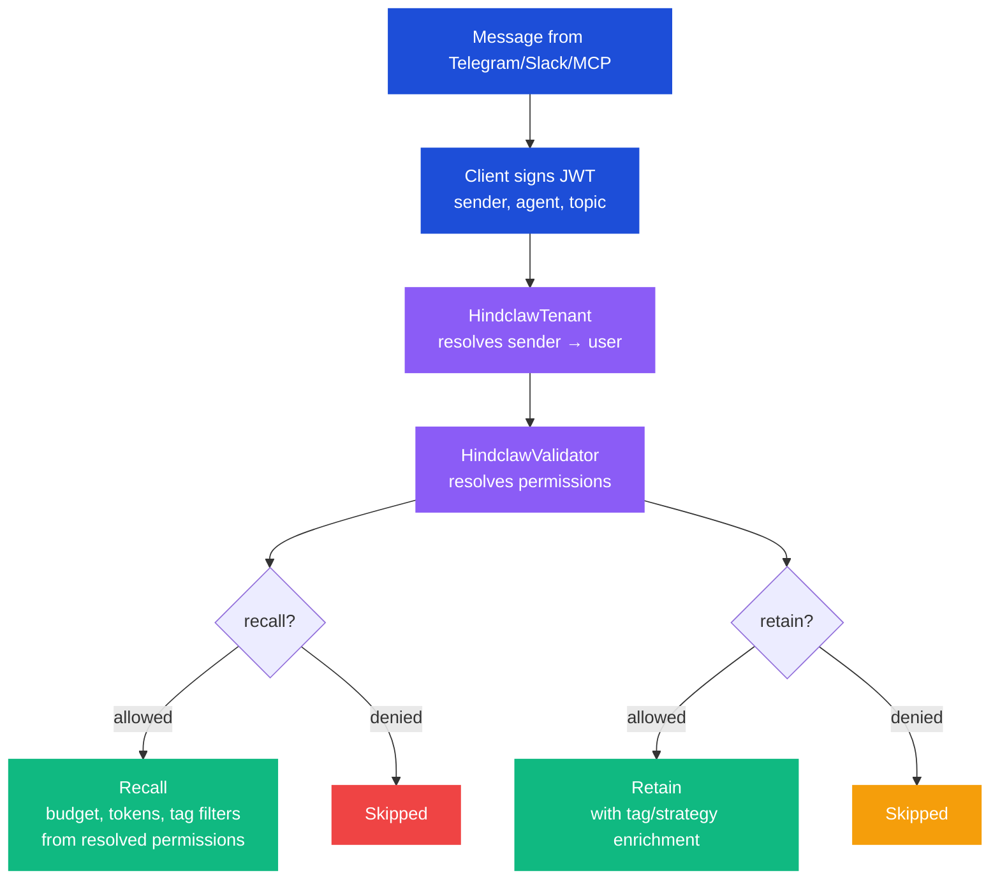
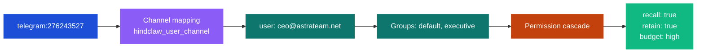
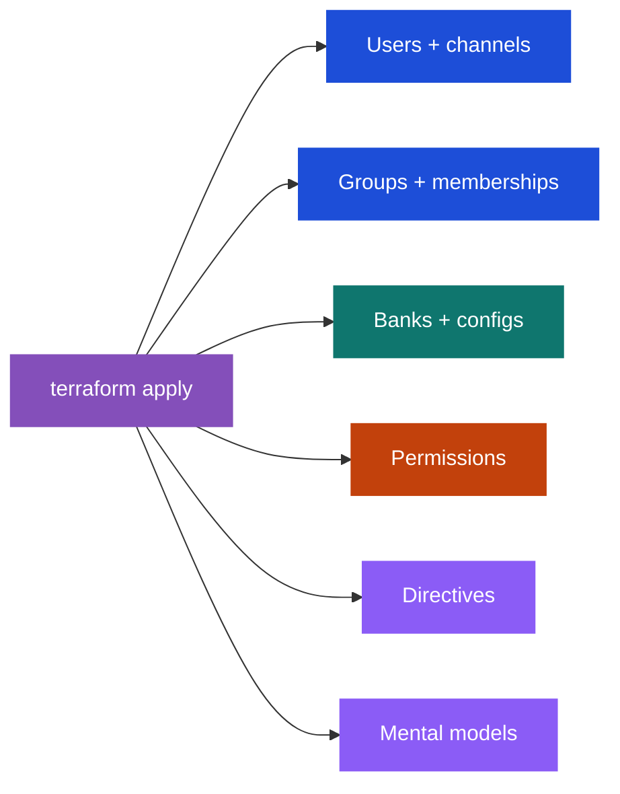
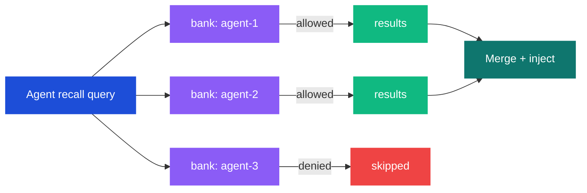
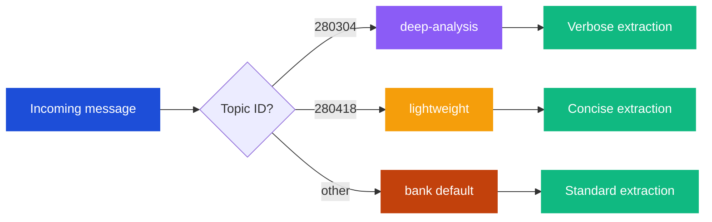

<p align="center">
  
</p>

<p align="center">
  Self-hosted Hindsight management platform — multi-tenant access control, user/group permissions, Terraform-managed infrastructure, and client integrations for AI agent memory.
</p>

<p align="center">
  <a href="https://www.npmjs.com/package/hindclaw-openclaw"></a>
  <a href="https://pypi.org/project/hindclaw-extension/"></a>
  <a href="https://registry.terraform.io/providers/mrkhachaturov/hindclaw/latest"></a>
  
</p>

<p align="center">
  <a href="https://hindclaw.pro">Documentation</a> &middot;
  <a href="https://hindsight.vectorize.io">Hindsight</a> &middot;
  <a href="https://openclaw.ai">OpenClaw</a>
</p>

---

## Why HindClaw?

Built on [Hindsight](https://hindsight.vectorize.io) — the highest-scoring agent memory system on the [LongMemEval benchmark](https://vectorize.io/#:~:text=The%20New%20Leader%20in%20Agent%20Memory).

The official Hindsight plugin gives you auto-capture and auto-recall. HindClaw adds what you need to run it in production with multiple users and agents:

- **Server-side access control** — permissions enforced by Hindsight extensions, not the client
- **Infrastructure as Code** — Terraform provider for users, groups, banks, permissions, directives, mental models
- **Zero-config plugin** — one install, auto-starts embed daemon with extensions loaded

---

## Architecture

Three layers, each independent:



**Key principle:** Access control lives on the server. Clients just deliver context (sender, agent, topic) — the server decides what's allowed.

---

### Message Flow

Every message follows the same path regardless of client:



### Identity Resolution



Unmapped senders resolve as `_anonymous` — denied by default unless the `_default` group grants access.

### Permission Cascade

Most specific wins. Every parameter is overridable at each level.

```
Global defaults → Group merge → Bank group override → Bank user override
```

**Configurable at every level:** `recall`, `retain`, `retainRoles`, `retainTags`, `retainEveryNTurns`, `recallBudget`, `recallMaxTokens`, `recallTagGroups`, `llmModel`, `llmProvider`, `excludeProviders`

**Same user, different agents:**

| | yoda (strategic) | r4p17 (financial) |
|---|---|---|
| **executive** | recall + retain, high budget | recall + retain, high budget |
| **staff** | recall only, filtered tags | recall + retain, low budget |
| **anonymous** | denied | denied |

---

## Infrastructure as Code

Manage everything with Terraform:



```hcl
resource "hindclaw_user" "alice" {
  id           = "alice@company.com"
  display_name = "Alice"
  email        = "alice@company.com"
}

resource "hindclaw_user_channel" "alice_telegram" {
  user_id          = hindclaw_user.alice.id
  channel_provider = "telegram"
  sender_id        = "123456789"
}

resource "hindclaw_group" "staff" {
  id           = "staff"
  display_name = "Staff"
  recall       = true
  retain       = true
  recall_budget = "mid"
}

resource "hindclaw_bank" "assistant" {
  bank_id = "assistant"
  name    = "Assistant"
  mission = "General purpose assistant"
  disposition_skepticism = 3
  disposition_empathy    = 4
}

resource "hindclaw_bank_permission" "staff_assistant" {
  bank_id    = hindclaw_bank.assistant.bank_id
  scope_type = "group"
  scope_id   = hindclaw_group.staff.id
  recall     = true
  retain     = true
}

resource "hindclaw_directive" "no_pii" {
  bank_id   = hindclaw_bank.assistant.bank_id
  name      = "no_pii"
  content   = "Never store personally identifiable information."
  is_active = true
}
```

See the [Terraform provider](https://registry.terraform.io/providers/mrkhachaturov/hindclaw/latest) for full documentation.

---

## Quick Start

### 1. Install the OpenClaw plugin

```bash
openclaw plugins install hindclaw-openclaw
```

### 2. Configure

```json5
{
  "plugins": {
    "entries": {
      "hindclaw": {
        "enabled": true,
        "config": {
          "jwtSecret": "your-secret-here",
          "dynamicBankGranularity": ["agent"]
        }
      }
    }
  }
}
```

### 3. Start

```bash
openclaw gateway
```

The plugin auto-starts a Hindsight daemon with extensions loaded. No separate server setup needed.

### 4. Manage with Terraform (optional)

```bash
terraform init
terraform apply
```

Define users, groups, permissions, bank configs, directives, and mental models as code.

---

## Packages

| Package | Registry | Purpose |
|---------|----------|---------|
| [`hindclaw-extension`](https://pypi.org/project/hindclaw-extension/) | PyPI | Server-side Hindsight extensions (auth, permissions, management API) |
| [`hindclaw-openclaw`](https://www.npmjs.com/package/hindclaw-openclaw) | npm | OpenClaw gateway plugin (JWT signing, lifecycle hooks) |
| [`terraform-provider-hindclaw`](https://registry.terraform.io/providers/mrkhachaturov/hindclaw/latest) | Terraform Registry | Infrastructure as Code for all resources |
| Go client | `go get github.com/mrkhachaturov/hindclaw/hindclaw-clients/go` | Generated API client for the management API |

---

## Features

### Server-Side Access Control

Three Hindsight extensions handle all access control on the server:

- **HindclawTenant** — authenticates JWT and API key tokens, resolves sender identity to a known user via channel mappings
- **HindclawValidator** — enforces recall/retain/reflect permissions per user per bank, injects tag filters and retain strategies via `accept_with()` enrichment
- **HindclawHttp** — REST API at `/ext/hindclaw/` for managing users, groups, permissions, strategies, and API keys

### Entity Labels

Controlled vocabulary for consistent fact classification. Labels produce both entities (graph traversal) and tags (filtering).

```hcl
entity_labels = [
  {
    key         = "person"
    description = "Known person. Use only these values."
    type        = "multi-values"
    tag         = true
    values = [
      { value = "alice", description = "Alice Smith (Алиса) — CEO" },
      { value = "bob",   description = "Bob Jones — CTO" },
    ]
  },
  {
    key         = "scope"
    description = "Visibility tier"
    type        = "value"
    tag         = true
    values = [
      { value = "public",     description = "Available to all" },
      { value = "management", description = "Management only" },
      { value = "owner",      description = "Owners only" },
    ]
  },
]
```

### Cross-Agent Recall

One agent queries multiple banks in parallel. Permissions checked per-bank.



### Named Retain Strategies

Different conversation topics routed to different extraction strategies:



### Zero-Config Embedded Mode

When `jwtSecret` is set in plugin config, the plugin:

1. Starts the Hindsight embed daemon
2. Installs `hindclaw-extension` into the daemon's venv
3. Configures all three extensions automatically
4. Connects via HTTP with JWT auth

No manual server setup, no profile editing, no separate daemon management.


---

## Documentation

| Guide | Description |
|-------|-------------|
| [hindclaw.pro](https://hindclaw.pro) | Full documentation site |
| [Terraform Provider](https://registry.terraform.io/providers/mrkhachaturov/hindclaw/latest/docs) | Provider docs on Terraform Registry |
| [Extension API](hindclaw-extension/) | Server extension source and tests |
| [Plugin Source](hindclaw-integrations/openclaw/) | OpenClaw plugin source and tests |

---

## Migration from @vectorize-io/hindsight-openclaw

```bash
openclaw plugins remove @vectorize-io/hindsight-openclaw
openclaw plugins install hindclaw-openclaw
```

Bank ID scheme is compatible — existing memories are preserved.

---

## Links

- [Hindsight](https://hindsight.vectorize.io) — the memory engine
- [OpenClaw](https://openclaw.ai) — the agent framework
- [GitHub](https://github.com/mrkhachaturov/hindclaw)

## License

MIT — see [LICENSE](LICENSE)

Based on [`@vectorize-io/hindsight-openclaw`](https://github.com/vectorize-io/hindsight/tree/main/hindsight-integrations/openclaw) (MIT, Copyright (c) 2025 Vectorize AI, Inc.)
