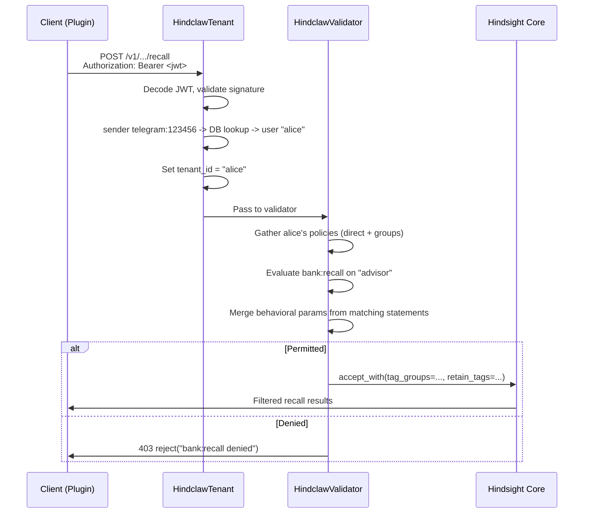
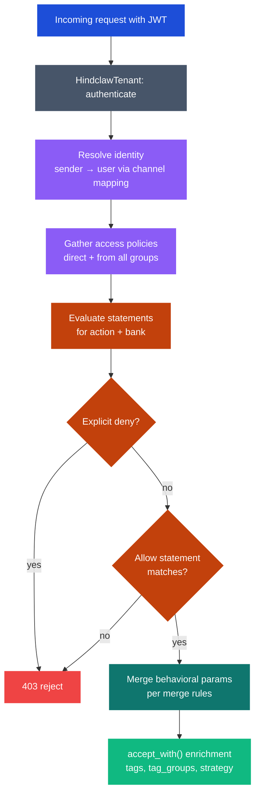
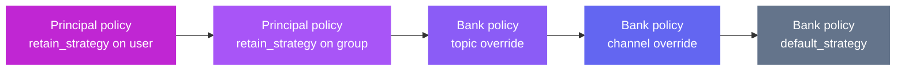

# Access Control

hindclaw provides per-principal memory access control enforced server-side through the `hindclaw-extension` -- a set of Hindsight server extensions that authenticate requests, evaluate policies, and enrich operations via `accept_with()`. The same user can get different behavior on different banks, channels, and topics -- different actions allowed, different recall budgets, different retain strategies.

All identity, policy, and bank configuration data lives in the Hindsight PostgreSQL database and is managed through the [Terraform provider](https://registry.terraform.io/providers/mrkhachaturov/hindclaw/latest). The plugin itself is a thin adapter: it generates a JWT from the OpenClaw context and sends standard Hindsight API calls. It does not store or evaluate policies.

:::info Server-side only
Policy evaluation runs entirely on the Hindsight server via the `hindclaw-extension`. There is no client-side permission logic in the plugin. The plugin sends a JWT with sender context -- the server resolves the principal, evaluates attached policies, and accepts or rejects the operation.
:::

## Mental model

The model is inspired by MinIO's IAM system:

- **Banks are buckets** -- each bank has its own policy for context-level configuration
- **Users are human principals** -- identified via channel mappings (e.g., `telegram:123456` → `alice`)
- **Groups are identity containers** -- no permission columns; they carry policies instead
- **Access policies are reusable documents** -- define allowed/denied actions on banks, with behavioral parameters
- **Service accounts are machine credentials** -- owned by a user, scoped by optional policy
- **Bank policies are per-bank configuration** -- default strategy, context overrides, public access rules

```
User: alice
  Groups: [default, executive]
  Access policies (direct): alice-overrides
  Access policies (via default): default-access
  Access policies (via executive): executive-upgrade

Service account: alice-claude
  Owned by: alice
  Scoping policy: claude-readonly  → intersected with alice's effective policy

Bank policy: advisor
  default_strategy: "advisor-default"
  strategy_overrides:
    channel=telegram → "advisor-telegram"
    topic=99001      → "advisor-project-alpha"
  public_access: null
```

## How it works

Three Hindsight extensions in one pip package, sharing the same database:

```
Client (OpenClaw plugin)
  |
  |  Authorization: Bearer <jwt>
  v
Hindsight API Server
  |
  +-- HindclawTenant (TenantExtension)
  |     JWT / API key -> principal identity
  |
  +-- HindclawValidator (OperationValidatorExtension)
  |     principal -> policies -> evaluate -> accept_with(enrichment)
  |
  +-- HindclawHttp (HttpExtension)
  |     /ext/hindclaw/* CRUD endpoints (used by Terraform provider)
  |
  +-- Hindsight Core (retain/recall/reflect)
```

Install the extension package on the Hindsight server:

```bash
pip install hindclaw-extension
```

Configure via environment variables:

```bash
HINDSIGHT_API_TENANT_EXTENSION=hindclaw_ext.tenant:HindclawTenant
HINDSIGHT_API_OPERATION_VALIDATOR_EXTENSION=hindclaw_ext.validator:HindclawValidator
HINDSIGHT_API_HTTP_EXTENSION=hindclaw_ext.http:HindclawHttp

# Shared secret for JWT validation (must match plugin config)
HINDSIGHT_API_TENANT_JWT_SECRET=shared-secret

# Root user bootstrap (created on first start)
HINDCLAW_ROOT_USER=admin
HINDCLAW_ROOT_API_KEY=hc_u_your-root-key
```

### Authentication

The extension accepts two token formats in the `Authorization` header:

**JWT** (for plugins acting on behalf of users):

```json
{
  "client_id": "openclaw-prod",
  "sender": "telegram:123456",
  "agent": "my-agent",
  "channel": "telegram",
  "topic": "99001",
  "iat": 1711000000,
  "exp": 1711000300
}
```

| Claim | Description |
|---|---|
| `client_id` | Identifies the trusted client (for audit logs) |
| `sender` | Raw sender ID from the channel, format `provider:id` |
| `agent` | Agent (bank) ID from OpenClaw context |
| `channel` | Channel type (telegram, slack, etc.) |
| `topic` | Topic ID within the channel (optional) |
| `iat` / `exp` | Issued-at and expiration. Short-lived (5 min). HMAC-SHA256 signed. |

The plugin generates this JWT from the OpenClaw message context and signs it with a shared secret. Plugin config is minimal:

```json5
{
  "hindsightApiUrl": "https://hindsight.home.local",
  "jwtSecret": "shared-secret-between-plugin-and-server"
}
```

**API keys** (for service accounts and user direct access):

- `hc_sa_` prefix -- service account key. Looked up in `hindclaw_service_account_keys`. Inherits parent user's effective policy, optionally narrowed by `scoping_policy_id`.
- `hc_u_` prefix -- user API key. Looked up in `hindclaw_api_keys`. Carries the user's full effective policy.

API key prefixes allow fast routing in `HindclawTenant` without cross-table scanning.

### Request flow



## Setting up users and channels

Users are identity records that map platform-specific sender IDs to a canonical principal. Manage users and their channel mappings via Terraform.

### Create a user

```hcl
resource "hindclaw_user" "alice" {
  id           = "alice"
  display_name = "Alice"
  email        = "alice@example.com"
  disable_user  = false
  force_destroy = false
}
```

The `disable_user` attribute deactivates the user without deleting their policies, memberships, or service accounts. All service accounts owned by a deactivated user are automatically denied. Re-activating the user restores all access.

### Add channel mappings

Channel mappings link platform sender IDs to the canonical user. When a message arrives from Telegram user `123456`, the extension resolves it to user `alice`.

```hcl
resource "hindclaw_user_channel" "alice_telegram" {
  user_id          = hindclaw_user.alice.id
  channel_provider = "telegram"
  sender_id        = "123456"
}

resource "hindclaw_user_channel" "alice_slack" {
  user_id          = hindclaw_user.alice.id
  channel_provider = "slack"
  sender_id        = "U123456"
}
```

## Creating groups

Groups collect users for shared policy attachment. They are identity-only -- no permission columns. Access is granted by attaching policies to groups, not by setting fields on the group itself.

```hcl
resource "hindclaw_group" "default" {
  id           = "default"
  display_name = "Default"
  force_destroy = false
}

resource "hindclaw_group" "executive" {
  id           = "executive"
  display_name = "Executive"
  force_destroy = false
}
```

### Add members to groups

```hcl
resource "hindclaw_group_membership" "alice_default" {
  group_id = hindclaw_group.default.id
  user_id  = hindclaw_user.alice.id
}

resource "hindclaw_group_membership" "alice_executive" {
  group_id = hindclaw_group.executive.id
  user_id  = hindclaw_user.alice.id
}

resource "hindclaw_group_membership" "bob_default" {
  group_id = hindclaw_group.default.id
  user_id  = hindclaw_user.bob.id
}
```

## Access policies

Access policies are reusable JSON documents with `version` and `statements[]`. Each statement has an `effect` (allow or deny), a list of `actions`, a list of `banks`, and optional behavioral parameters.

### Policy document shape

```json
{
  "version": "2026-03-24",
  "statements": [
    {
      "effect": "allow",
      "actions": ["bank:recall", "bank:reflect"],
      "banks": ["*"],
      "recall_budget": "mid",
      "recall_max_tokens": 1024
    },
    {
      "effect": "allow",
      "actions": ["bank:retain"],
      "banks": ["*"],
      "retain_roles": ["user", "assistant"],
      "retain_tags": ["role:staff"],
      "retain_every_n_turns": 1
    },
    {
      "effect": "deny",
      "actions": ["bank:recall", "bank:retain"],
      "banks": ["restricted-bank"]
    }
  ]
}
```

### Actions

Three core bank actions:

| Action | Meaning |
|---|---|
| `bank:recall` | Retrieve raw memories |
| `bank:reflect` | LLM-synthesized answers (independent of recall) |
| `bank:retain` | Store new memories |

`reflect` is a separate action -- it can be granted without `recall` (e.g., a service account that synthesizes answers but cannot see raw memory entries). `bank:*` matches all bank actions.

### Bank matching

- `"*"` matches all banks
- Exact match: `"advisor"` matches only the `advisor` bank
- Prefix wildcard: `"yoda::*"` matches banks whose ID starts with `yoda::` (e.g., `yoda::group:-100...::42`). Does not match the exact bank `yoda` -- list both `["yoda", "yoda::*"]` to cover the base bank and all derived children.

### Behavioral parameters

Optional on any `allow` statement. Define how the granted action behaves for this principal:

| Field | Applies to | Merge rule |
|---|---|---|
| `recall_budget` | recall | Most permissive wins (`high` > `mid` > `low`) |
| `recall_max_tokens` | recall | Highest value wins |
| `recall_tag_groups` | recall | AND-ed together (all filters must pass) |
| `retain_roles` | retain | Union across all sources |
| `retain_tags` | retain | Union across all sources |
| `retain_every_n_turns` | retain | Lowest value wins (most frequent) |
| `retain_strategy` | retain | Most specific principal wins |
| `llm_model` | reflect | Most specific statement wins |
| `llm_provider` | reflect | Most specific statement wins |
| `exclude_providers` | recall | Union (more exclusions) |

### Creating and attaching policies

Use `data "hindclaw_policy_document"` to build policy JSON from HCL, then `hindclaw_policy` to store it, then `hindclaw_policy_attachment` to attach it to a user or group.

```hcl
# Build policy JSON from HCL blocks
data "hindclaw_policy_document" "default_access" {
  statement {
    effect               = "allow"
    actions              = ["bank:recall", "bank:reflect", "bank:retain"]
    banks                = ["*"]
    recall_budget        = "mid"
    recall_max_tokens    = 1024
    retain_roles         = ["user", "assistant"]
    retain_every_n_turns = 1
  }
}

# Store as a named policy
resource "hindclaw_policy" "default_access" {
  id           = "default-access"
  display_name = "Default fleet access"
  document     = data.hindclaw_policy_document.default_access.json
}

# Attach to the default group
resource "hindclaw_policy_attachment" "default_access" {
  principal_type = "group"
  principal_id   = hindclaw_group.default.id
  policy_id      = hindclaw_policy.default_access.id
  priority       = 0
}
```

Multiple policies can be attached to the same principal. Attach an upgrade policy to a group at higher priority to override single-value fields (like `llm_model`) for that group's members:

```hcl
# Executive upgrade: higher recall budget and token limit
data "hindclaw_policy_document" "executive_upgrade" {
  statement {
    effect            = "allow"
    actions           = ["bank:recall"]
    banks             = ["*"]
    recall_budget     = "high"
    recall_max_tokens = 2048
  }
}

resource "hindclaw_policy" "executive_upgrade" {
  id           = "executive-upgrade"
  display_name = "Executive recall upgrade"
  document     = data.hindclaw_policy_document.executive_upgrade.json
}

resource "hindclaw_policy_attachment" "executive_upgrade" {
  principal_type = "group"
  principal_id   = hindclaw_group.executive.id
  policy_id      = hindclaw_policy.executive_upgrade.id
  priority       = 10  # higher than default-access, wins on single-value fields
}
```

### Built-in policies

The server ships these built-in policies. They cannot be modified or deleted:

| Policy | Grants |
|---|---|
| `bank:readwrite` | `bank:recall`, `bank:reflect`, `bank:retain` on `*` |
| `bank:readonly` | `bank:recall`, `bank:reflect` on `*` |
| `bank:retain-only` | `bank:retain` on `*` |
| `bank:admin` | All `bank:*` actions on `*` |
| `iam:admin` | All `iam:*` control plane actions |

Attach them by ID: `policy_id = "bank:readwrite"`.

## Policy evaluation

### For users



Steps:

1. **Resolve identity** -- `HindclawTenant` decodes the JWT, extracts `sender` (e.g., `telegram:123456`), looks up `hindclaw_user_channels` to find the canonical user. If no match, the request is `_unmapped` -- checked against bank public access.

2. **Gather policies** -- Collect all policies directly attached to the user, plus all policies attached to each of the user's groups.

3. **Evaluate statements** -- Find all `allow` and `deny` statements that match the requested action and bank. Deny takes absolute precedence -- any matching deny blocks the request regardless of priority.

4. **Merge behavioral parameters** -- When multiple allow statements match, merge their behavioral parameters using the per-field rules. For single-value fields (`llm_model`, `retain_strategy`): most specific principal wins (user-attached > group-attached), then exact bank > wildcard, then higher `priority` value on the attachment, then lexical policy ID as final tiebreaker.

5. **Enrich** -- The validator calls `accept_with()` to inject resolved `tag_groups`, `retain_tags` (including auto-injected `user:<id>` and `agent:<id>` tags), and `retain_strategy` into the Hindsight operation.

### Precedence for single-value fields

| Priority | Source | Example |
|---|---|---|
| 1 (highest) | User-attached policy, exact bank | User policy with `"banks": ["advisor"]` |
| 2 | User-attached policy, wildcard bank | User policy with `"banks": ["*"]` |
| 3 | Group-attached policy, exact bank | Group policy with `"banks": ["advisor"]` |
| 4 (lowest) | Group-attached policy, wildcard bank | Group policy with `"banks": ["*"]` |

Within the same level, higher `priority` on the attachment wins. Ties break on lexical policy ID. The `priority` field only affects single-value fields (`llm_model`, `llm_provider`, `retain_strategy`). Additive fields (tags, tag_groups, exclude_providers) union across all sources. Max/min fields (budget, max_tokens, every_n_turns) use their merge rules regardless of priority.

## Service accounts

Service accounts are machine principals -- for MCP clients, Terraform, CI/CD, dashboards. Each is owned by one user and inherits the parent user's full effective policy by default.

```hcl
# SA with full inheritance -- used for Terraform
resource "hindclaw_service_account" "alice_terraform" {
  id            = "alice-terraform"
  owner_user_id = hindclaw_user.alice.id
  display_name  = "Alice — Terraform"
}

resource "hindclaw_service_account_key" "alice_terraform" {
  service_account_id = hindclaw_service_account.alice_terraform.id
  description        = "Terraform provider key"
}

output "alice_terraform_key" {
  value     = hindclaw_service_account_key.alice_terraform.api_key
  sensitive = true
}
```

### Scoping a service account

Use `scoping_policy_id` to narrow the SA's access below its parent user's effective policy. The SA gets only permissions that appear in both the parent's effective policy and the scoping policy (intersection). The SA can never exceed the parent's permissions even if the scoping policy is broader.

```hcl
# Scoping policy: read-only on specific banks
data "hindclaw_policy_document" "claude_readonly" {
  statement {
    effect  = "allow"
    actions = ["bank:recall", "bank:reflect"]
    banks   = ["advisor", "ops-agent"]
  }
}

resource "hindclaw_policy" "claude_readonly" {
  id           = "claude-readonly"
  display_name = "Claude MCP read-only"
  document     = data.hindclaw_policy_document.claude_readonly.json
}

# SA scoped to read-only on two banks only
resource "hindclaw_service_account" "alice_claude" {
  id                = "alice-claude"
  owner_user_id     = hindclaw_user.alice.id
  display_name      = "Alice — Claude Code MCP"
  scoping_policy_id = hindclaw_policy.claude_readonly.id
}

resource "hindclaw_service_account_key" "alice_claude" {
  service_account_id = hindclaw_service_account.alice_claude.id
  description        = "Claude Code MCP key"
}
```

A service account has at most one scoping policy. This prevents accidental privilege broadening through multiple policy union.

### Intersection rules

When a scoping policy is set, behavioral parameters resolve to the more restrictive of the two sources:

| Field | Intersection rule |
|---|---|
| `recall_budget` | Lower budget wins |
| `recall_max_tokens` | Lower value wins |
| `recall_tag_groups` | Union (AND-ed -- more filtering) |
| `retain_roles` | Intersection (only roles in both) |
| `retain_every_n_turns` | Higher value wins (less frequent) |
| `retain_tags` | Union (more tags) |
| `retain_strategy` | Scoping policy wins if set |
| `llm_model` | Scoping policy wins if set |
| `exclude_providers` | Union (more exclusions) |

## Bank policies

Bank policies are per-bank configuration documents. They define the default retain strategy, context-level strategy overrides (per-channel, per-topic), and public access rules for unmapped senders.

```hcl
resource "hindclaw_bank_policy" "advisor" {
  bank_id  = "advisor"
  document = jsonencode({
    version          = "2026-03-24"
    default_strategy = "advisor-default"
    strategy_overrides = [
      { scope = "channel", value = "telegram", strategy = "advisor-telegram" },
      { scope = "topic",   value = "99001",    strategy = "advisor-project-alpha" },
    ]
    public_access = {
      default = null  # no public access by default
      overrides = [
        {
          scope             = "provider"
          value             = "web"
          actions           = ["bank:recall", "bank:reflect"]
          recall_budget     = "low"
          recall_max_tokens = 512
        }
      ]
    }
  })
}
```

### Strategy resolution

When the validator needs a retain strategy for a request:



1. Check the principal's effective access policy for `retain_strategy` on this bank -- most specific principal wins (user-attached > group-attached)
2. If no principal-level strategy: check the bank policy for context overrides -- most specific context wins (topic > channel)
3. If neither: use the bank policy's `default_strategy`, or Hindsight's built-in default if none is set

### Public access for unmapped senders

When a sender has no channel mapping (`_unmapped`), the validator checks the bank policy's `public_access` section. This is how agents can serve unknown customers or web visitors without creating HindClaw user accounts for them.

Resolution order for `_unmapped`:

1. Match context against `public_access.overrides` -- most specific wins (topic > channel > provider)
2. If no match and `public_access.default` is null -- denied
3. If match found -- grant only the listed actions with the listed parameters

A non-null `default` grants access to all unmapped senders regardless of context:

```json
"public_access": {
  "default": {
    "actions": ["bank:recall"],
    "recall_budget": "low",
    "recall_max_tokens": 256
  }
}
```

Banks without a bank policy deny all unmapped senders by default.

## Tag-based filtering

`recall_tag_groups` in policy statements uses Hindsight's tag filtering API to control what memories a principal can see during recall. The extension passes the resolved `tag_groups` to `accept_with()`, and Hindsight core applies the filter.

Tags on facts come from two sources:

1. **Extension-injected tags** -- `retain_tags` from policy statements (e.g., `role:executive`) plus automatic `user:<id>` and `agent:<id>` tags injected during retain
2. **LLM-extracted tags** -- Entity labels with `tag: true` in the bank config (e.g., `department:sales`, `sensitivity:restricted`)

Filter examples in policy statements:

```json5
// See everything (no filter) -- omit recall_tag_groups or set to null
{ "effect": "allow", "actions": ["bank:recall"], "banks": ["*"] }

// Exclude restricted content
{
  "effect": "allow",
  "actions": ["bank:recall"],
  "banks": ["*"],
  "recall_tag_groups": [
    { "not": { "tags": ["sensitivity:restricted"], "match": "any_strict" } }
  ]
}

// Only see sales department content
{
  "effect": "allow",
  "actions": ["bank:recall"],
  "banks": ["*"],
  "recall_tag_groups": [
    { "tags": ["department:sales"], "match": "any" }
  ]
}
```

## Bootstrap

On first install, hindclaw creates the root user automatically from environment variables -- the same approach as MinIO's `MINIO_ROOT_USER` / `MINIO_ROOT_PASSWORD`.

```bash
HINDCLAW_ROOT_USER=admin
HINDCLAW_ROOT_API_KEY=hc_u_your-root-key-here
```

On startup, the server ensures the root user exists with the built-in `iam:admin` and `bank:admin` policies attached. The root user is a real user -- not a special principal type. It authenticates the same way as any other user, can own service accounts, and is managed through the same API. The root API key acts as break-glass access.

## Debug endpoint

The debug endpoint resolves the effective access policy for a given context without executing an operation. Available at `/ext/hindclaw/debug/resolve`:

```json
{
  "tenant_id": "alice",
  "principal_type": "user",
  "access": {
    "allowed": true,
    "resolved_user_id": "alice",
    "recall_budget": "high",
    "recall_max_tokens": 2048,
    "recall_tag_groups": null,
    "retain_roles": ["user", "assistant"],
    "retain_tags": ["role:executive", "user:alice"],
    "retain_strategy": "project-alpha",
    "retain_every_n_turns": 1,
    "llm_model": null,
    "llm_provider": null,
    "exclude_providers": []
  },
  "bank_policy": {
    "default_strategy": "advisor-default",
    "strategy_overrides": [
      { "scope": "topic", "value": "99001", "strategy": "advisor-project-alpha" }
    ],
    "public_access": { "default": null, "overrides": [] }
  }
}
```

The `access` section shows the fully merged effective permissions for the principal on this bank and action. The `bank_policy` section shows the resolved bank configuration.

## Practical example

Three users, two agents, different access:

| | advisor (strategic) | ops-agent (operations) |
|---|---|---|
| **alice** (executive) | recall + retain + reflect, high budget, no tag filter | recall + retain, high budget |
| **bob** (staff) | recall + reflect only, mid budget | recall + retain, mid budget |
| **anonymous** | blocked (no public access) | blocked |

```hcl
# 1. Users
resource "hindclaw_user" "alice" {
  id           = "alice"
  display_name = "Alice"
}

resource "hindclaw_user" "bob" {
  id           = "bob"
  display_name = "Bob"
}

# 2. Channel mappings
resource "hindclaw_user_channel" "alice_telegram" {
  user_id          = hindclaw_user.alice.id
  channel_provider = "telegram"
  sender_id        = "111111"
}

resource "hindclaw_user_channel" "bob_telegram" {
  user_id          = hindclaw_user.bob.id
  channel_provider = "telegram"
  sender_id        = "222222"
}

# 3. Groups (identity-only, no permission columns)
resource "hindclaw_group" "default" {
  id           = "default"
  display_name = "Default"
}

resource "hindclaw_group" "executive" {
  id           = "executive"
  display_name = "Executive"
}

# 4. Group memberships
resource "hindclaw_group_membership" "alice_default"    { group_id = hindclaw_group.default.id;    user_id = hindclaw_user.alice.id }
resource "hindclaw_group_membership" "alice_executive"  { group_id = hindclaw_group.executive.id;  user_id = hindclaw_user.alice.id }
resource "hindclaw_group_membership" "bob_default"      { group_id = hindclaw_group.default.id;    user_id = hindclaw_user.bob.id }

# 5. Baseline policy: recall + reflect + retain on all banks
data "hindclaw_policy_document" "default_access" {
  statement {
    effect            = "allow"
    actions           = ["bank:recall", "bank:reflect", "bank:retain"]
    banks             = ["*"]
    recall_budget     = "mid"
    recall_max_tokens = 1024
    retain_roles      = ["user", "assistant"]
  }
}

resource "hindclaw_policy" "default_access" {
  id           = "default-access"
  display_name = "Default fleet access"
  document     = data.hindclaw_policy_document.default_access.json
}

resource "hindclaw_policy_attachment" "default_access" {
  principal_type = "group"
  principal_id   = hindclaw_group.default.id
  policy_id      = hindclaw_policy.default_access.id
  priority       = 0
}

# 6. Executive upgrade: higher recall budget
data "hindclaw_policy_document" "executive_upgrade" {
  statement {
    effect            = "allow"
    actions           = ["bank:recall"]
    banks             = ["*"]
    recall_budget     = "high"
    recall_max_tokens = 2048
  }
}

resource "hindclaw_policy" "executive_upgrade" {
  id           = "executive-upgrade"
  display_name = "Executive recall upgrade"
  document     = data.hindclaw_policy_document.executive_upgrade.json
}

resource "hindclaw_policy_attachment" "executive_upgrade" {
  principal_type = "group"
  principal_id   = hindclaw_group.executive.id
  policy_id      = hindclaw_policy.executive_upgrade.id
  priority       = 10
}

# 7. Alice override: deny retain on advisor
data "hindclaw_policy_document" "alice_overrides" {
  statement {
    effect  = "deny"
    actions = ["bank:retain"]
    banks   = ["advisor"]
  }
}

resource "hindclaw_policy" "alice_overrides" {
  id           = "alice-overrides"
  display_name = "Alice per-bank overrides"
  document     = data.hindclaw_policy_document.alice_overrides.json
}

resource "hindclaw_policy_attachment" "alice_overrides" {
  principal_type = "user"
  principal_id   = hindclaw_user.alice.id
  policy_id      = hindclaw_policy.alice_overrides.id
}

# 8. Bob override: deny retain on advisor (recall + reflect only on advisor)
data "hindclaw_policy_document" "bob_overrides" {
  statement {
    effect  = "deny"
    actions = ["bank:retain"]
    banks   = ["advisor"]
  }
}

resource "hindclaw_policy" "bob_overrides" {
  id           = "bob-overrides"
  display_name = "Bob per-bank overrides"
  document     = data.hindclaw_policy_document.bob_overrides.json
}

resource "hindclaw_policy_attachment" "bob_overrides" {
  principal_type = "user"
  principal_id   = hindclaw_user.bob.id
  policy_id      = hindclaw_policy.bob_overrides.id
}
```

Result:
- **alice**: default-access (mid budget, all actions) + executive-upgrade (high budget) + alice-overrides (deny retain on advisor). On advisor: recall + reflect only, high budget. On ops-agent: recall + retain + reflect, high budget.
- **bob**: default-access (mid budget, all actions) + bob-overrides (deny retain on advisor). On advisor: recall + reflect only, mid budget. On ops-agent: recall + retain + reflect, mid budget.
- **anonymous**: no channel mapping → `_unmapped`. No bank policy with public access → denied on both banks.
