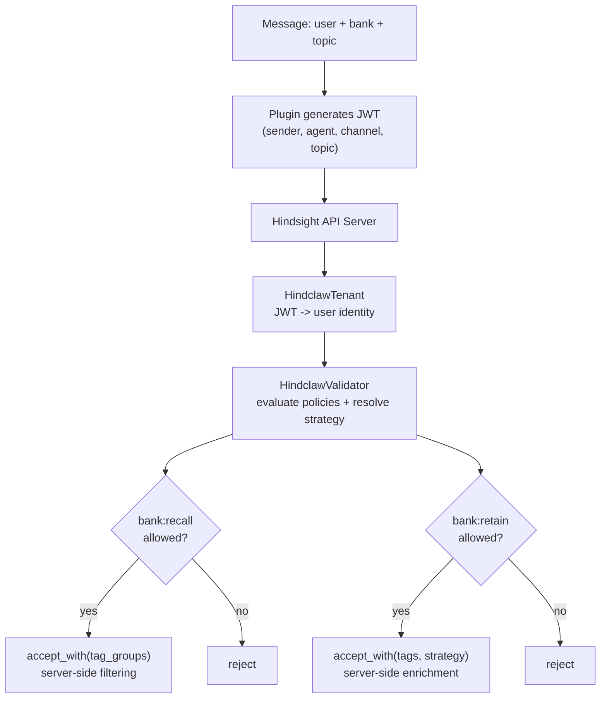

# What is HindClaw?

HindClaw is a production-grade [Hindsight](https://hindsight.vectorize.io) memory system for [OpenClaw](https://github.com/openclaw/openclaw). It consists of two components: a **thin plugin** that generates JWTs and sends standard Hindsight API calls, and a **server extension** (`hindclaw-extension`) that enforces access control, resolves policies, and enriches requests with tags and strategies. Together they give your AI agent fleet long-term memory with per-agent configuration, multi-bank recall, named retain strategies, and infrastructure-as-code management.

## Two Dimensions

Every message resolves along two orthogonal axes:

**WHO** -- access enforced server-side by the hindclaw-extension using a policy-based model. Policies are versioned JSON documents with allow/deny statements that control what actions a principal can perform on which banks, plus behavioral parameters (recall budget, token limits, retain roles, etc.). Policies are attached to users or groups via `hindclaw_policy_attachment`. The policy engine collects all policies from the user and their groups, deny takes precedence, then the most specific allow wins. Service accounts inherit their parent user's full effective policy, optionally narrowed by a single scoping policy.

**HOW** -- strategy resolved server-side via bank policies. Each bank has a `bank_policy` document that defines a default retain strategy and context-level overrides (per-channel, per-topic). If the principal's access policy sets a `retain_strategy`, that takes precedence over the bank policy. Strategy selection and tag enrichment happen entirely server-side.

Policy evaluation, tag injection, and strategy selection all happen server-side in the hindclaw-extension. The plugin is a thin adapter that generates a JWT and sends standard Hindsight API calls. Every combination of **(user x bank x topic)** can produce different behavior.

## Core Features

**Policy-based access control** -- access policies are reusable JSON documents with versioned allow/deny statements. Each statement targets specific actions (`bank:recall`, `bank:retain`, `bank:reflect`, extended bank actions) and banks (exact, prefix wildcard, or `*`). Deny overrides allow at any specificity level. Behavioral parameters (`recall_budget`, `recall_max_tokens`, `retain_roles`, `retain_strategy`, etc.) travel on the same statement. Policies are attached to users and groups via `hindclaw_policy_attachment` with a priority value for tie-breaking.

**Service accounts** -- machine principals owned by a user. A service account inherits its parent user's full effective access policy by default. Attach a single scoping policy to narrow it below the parent's access without ever exceeding it. Service accounts are the primary auth mechanism for MCP clients, Terraform, Claude Code, and CI/CD.

**Bank policies** -- per-bank configuration documents that define the bank's default retain strategy and context-level strategy overrides (by channel, topic, or provider). Bank policies also control public access for unmapped senders (anonymous customers in a Telegram group, web chat visitors) without requiring HindClaw user accounts.

**Per-endpoint IAM** -- granular control plane actions (`iam:users:read`, `iam:groups:write`, `iam:policies:write`, `iam:service_accounts:write`, etc.) controlled by the same policy engine. Admins get `iam:*` via the built-in `iam:admin` policy.

**Root user bootstrap** -- on first install, HindClaw auto-creates the root user from `HINDCLAW_ROOT_USER` / `HINDCLAW_ROOT_API_KEY` environment variables with full admin policies attached. The root user is a real user, not a special principal type. It authenticates the same way as any other user and acts as break-glass access after bootstrap.

**Per-agent bank configs** -- each agent gets its own retain mission, entity labels, dispositions, and directives via the bank's strategy configuration. Bank configs, users, groups, policies, directives, and mental models are managed via the [Terraform provider](https://registry.terraform.io/providers/mrkhachaturov/hindclaw/latest).

**Multi-bank recall** -- agents read from multiple banks in parallel. A strategic advisor recalls from finance, marketing, and ops banks simultaneously. The principal needs `bank:recall` on each bank in the list.

**Session start context** -- mental models loaded before the first message. No cold start.

**Reflect-on-recall** -- use Hindsight's reflect API (`bank:reflect`) instead of raw recall for richer, reasoned responses. Reflect is a distinct action from recall -- it can be granted independently.

**Multi-server** -- per-agent infrastructure routing. One gateway, multiple Hindsight servers (home, office, local daemon).

**Infrastructure as Code** -- the **[terraform-provider-hindclaw](https://registry.terraform.io/providers/mrkhachaturov/hindclaw/latest)** manages the full stack -- users, groups, policies, policy attachments, service accounts, bank policies, directives, and mental models -- as standard Terraform resources. All HindClaw infrastructure is declared in `.tf` files and applied with `terraform apply`.

## Built on Hindsight

[Hindsight](https://hindsight.vectorize.io) is a biomimetic memory system for AI agents with semantic, BM25, graph, and temporal retrieval. HindClaw is a client that maps OpenClaw concepts (agents, channels, topics, users) onto Hindsight capabilities (banks, strategies, tags, tag_groups).

:::tip Looking for a managed solution?
Skip the self-hosting and use [Hindsight Cloud](https://ui.hindsight.vectorize.io/signup) — managed memory infrastructure by [Vectorize](https://vectorize.io), the team behind Hindsight.
:::

## Next Steps

- [Installation](./getting-started/installation) -- set up the plugin and (optionally) the server extension
- [Terraform Provider](./guides/terraform) -- manage bank configs, users, groups, and policies as code
- [Access Control](./guides/access-control) -- set up multi-user permissions via hindclaw-extension
- [Configuration Reference](./reference/configuration) -- plugin and JWT configuration
