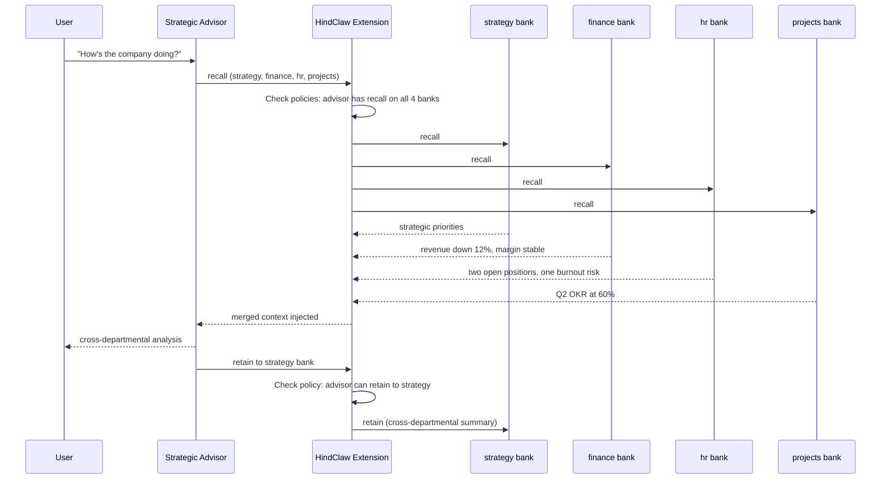
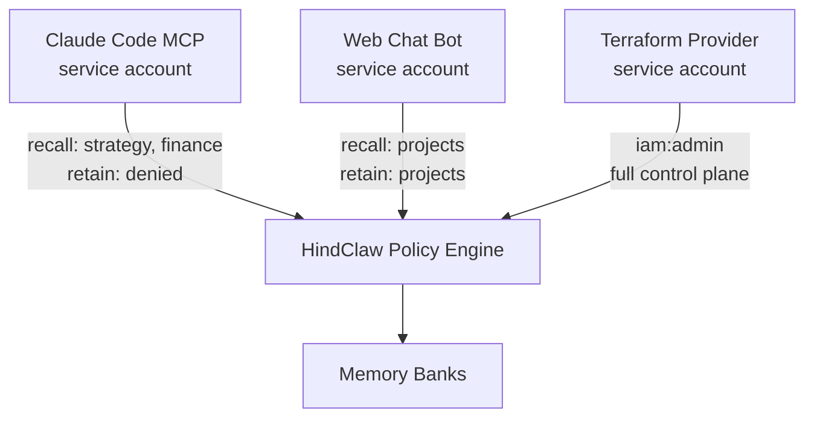
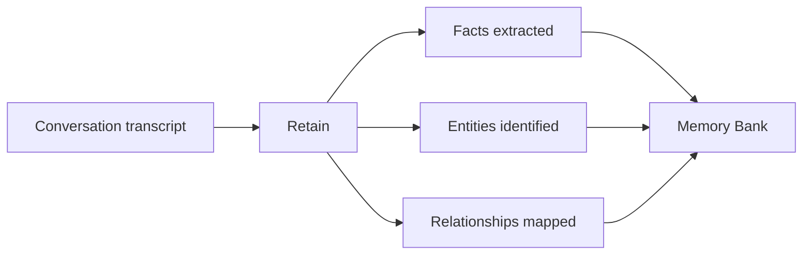
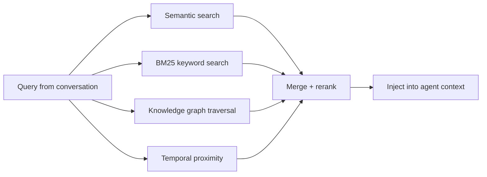
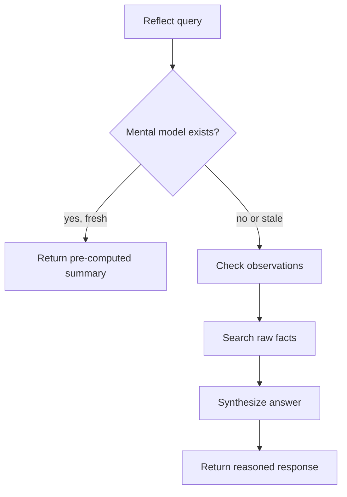

# HindClaw: AI Memory Orchestrator

HindClaw is a management layer for AI agent memory, built on [Hindsight](https://hindsight.vectorize.io) by [Vectorize](https://vectorize.io), the highest-scoring agent memory system on the [LongMemEval benchmark](https://hindsight.vectorize.io/blog/agent-memory-benchmark) (90%+). Hindsight handles the hard part: fact extraction, knowledge graphs, semantic recall, mental models. HindClaw adds what's missing when you go to production: access control, strategy routing, service accounts, and a control plane to orchestrate it all. Everything is managed as code through a [Terraform provider](https://registry.terraform.io/providers/mrkhachaturov/hindclaw/latest) or REST API.

## Why this exists

AI agents already have memory. OpenClaw writes markdown files to disk. Claude Code keeps its own memory. Most frameworks have something. Hindsight goes further and gives you a proper memory engine with automated extraction, retrieval across four parallel strategies, and reflection that reasons over what it knows.

But here's what I ran into when I had 11 agents and started thinking about deploying this at the office: who decides what each agent can remember? Which agents can read from which memory banks? How do you give a strategic advisor access to every department's knowledge while keeping HR data away from the marketing bot?

Think about Confluence. Nobody gives each user their own isolated space and copies documents around. You organize by domain: engineering, finance, HR, strategy. Then you control who reads, who writes, what they see. One source of truth per domain.

Memory banks should work the same way. A finance bank holds financial knowledge. An HR bank holds HR data. A strategy bank collects cross-departmental insights. Agents that need finance data query the finance bank. The ones that shouldn't, can't. You manage who has access to what through policies, as code or through an API.

Hindsight gives you the banks. HindClaw gives you the rules.

## What you get

Say you're running a company with a few AI agents, each with a different job:

| Agent | Role | Memory bank |
|-------|------|-------------|
| Strategic advisor | Cross-departmental analysis, priorities | `strategy` |
| Finance analyst | Revenue, margins, budgets | `finance` |
| HR assistant | Team health, attendance, capacity | `hr` |
| Project manager | Tasks, deadlines, OKRs | `projects` |

Each agent owns a bank, organized by domain. Now the questions come up: can the strategic advisor read from all four banks? Can the HR assistant write to the finance bank? Can an intern only recall from their department? Can a CI bot have read-only access?

HindClaw answers these with policies. A policy is a JSON document with allow/deny statements. Here's one:

```json
{
  "version": "2026-03-24",
  "statements": [
    {
      "effect": "allow",
      "actions": ["bank:recall", "bank:reflect"],
      "banks": ["strategy", "finance"],
      "recall_budget": "high",
      "recall_max_tokens": 2048
    },
    {
      "effect": "deny",
      "actions": ["bank:retain"],
      "banks": ["hr"]
    }
  ]
}
```

This policy lets its holder read from `strategy` and `finance` with a high recall budget, and blocks writing to `hr`. Attach policies to users or groups, set priority to break ties. When multiple allow statements match, the highest-priority one sets the behavioral parameters (budget, tokens, roles). Deny always wins regardless of priority. If you've used MinIO IAM policies, this will feel familiar.

Here's what happens when the strategic advisor asks "how's the company doing?":



The advisor reads from four banks but writes only to its own. HindClaw checks policies on every operation. The finance analyst's latest observations feed into the advisor's session at startup through mental models, so it already knows the numbers before anyone asks. The agents never exchange messages. Knowledge flows through the banks, controlled by policies.

For machines that need memory access, there are service accounts. A Terraform provider, a Claude Code MCP server, a customer-facing chat bot: each gets its own API key scoped to the banks and actions it needs. A service account inherits its parent user's access and can be narrowed with a scoping policy.



Each bank also has its own strategy configuration. Telegram conversations can use one extraction strategy while topic threads use another. You can open public access for unmapped senders, like customers in a web chat, without creating HindClaw accounts for them.

The control plane is API-first. Call the REST API directly, or use the [Terraform provider](https://registry.terraform.io/providers/mrkhachaturov/hindclaw/latest) for a declarative approach. Like Kubernetes gives you a declarative way to manage containers, HindClaw gives you a declarative way to manage memory: define the desired state, apply it, let the system converge. A management UI is in the works.

## Architecture

```
Integrations                    Hindsight Server
┌─────────────┐                ┌──────────────────────────────┐
│ OpenClaw    │──── JWT ──────>│  HindClaw Extension          │
│ Plugin      │                │    Tenant  (identity)        │
├─────────────┤                │    Validator (policy engine)  │
│ Claude Code │── SA Key ─────>│    Http  (admin API)         │
│ MCP         │                │           |                   │
├─────────────┤                │           v                   │
│ Web Chat    │── SA Key ─────>│    Hindsight Core             │
│ (planned)   │                │    retain / recall / reflect  │
├─────────────┤                │    knowledge graph, facts,    │
│ Any tool    │── JWT/Key ────>│    mental models, embeddings  │
└─────────────┘                └──────────────────────────────┘
                                          |
                               ┌──────────┴──────────┐
                               │  Terraform Provider  │
                               │  users, groups,      │
                               │  policies, SAs,      │
                               │  bank config, ...    │
                               └──────────────────────┘
```

Integrations are thin clients. Plugins generate short-lived JWTs signed with a shared HMAC secret (configured on both the plugin and server, no external identity provider needed). Service accounts use static API keys (`hc_sa_` prefix). The extension sits server-side, intercepts every request, checks policies, resolves strategies, injects tags. If the extension is unreachable or crashes, Hindsight rejects requests (fail-closed, not fail-open). The Terraform provider manages the control plane as code.

Two integrations exist today: an OpenClaw plugin and a Claude Code MCP server. Anything that can make HTTP calls with a bearer token can connect.

## Built on Hindsight

[Hindsight](https://hindsight.vectorize.io) is an open source memory engine by [Vectorize](https://vectorize.io). If you're not familiar with it, here are the three core operations:

### Retain: conversations become structured knowledge

When an agent finishes a conversation turn, the transcript is sent to Hindsight. An LLM extracts discrete facts, entities, and relationships from it automatically. You don't tell it what to remember.



A conversation about a supplier change might produce: "Detail margin dropped to 27% after switching primer supplier in January" (fact), "AcmePrimer" (entity), "AcmePrimer supplies Detail department" (relationship). All of this happens in the background after each turn.

### Recall: find relevant memories before each response

Before an agent responds, Hindsight searches the bank for relevant memories. It runs four retrieval strategies in parallel and merges the results:



The agent doesn't call a search tool. Memories are injected into context before the agent sees the user's message.

### Reflect: reason over memories, not just retrieve them

Recall returns raw facts. Reflect goes further: Hindsight reasons over what it knows and produces a synthesized answer. It checks mental models first (pre-computed summaries), then observations (patterns across facts), then raw facts.



When you ask "what's the financial situation this quarter?", reflect doesn't return 50 individual facts. It returns a coherent analysis built from everything the bank knows.

### Mental models

Mental models are Hindsight's way of maintaining an up-to-date understanding of a topic. You define a model with a query ("What are the current strategic priorities?") and Hindsight keeps the answer fresh. Every time new facts arrive and consolidate, the mental model re-runs its query and updates.

Agents can load mental models at session start via the plugin's `session_start` hook. The plugin makes API calls to fetch configured mental models before the first user message arrives, so the agent wakes up with current context. The strategic advisor loads its "company priorities" model, the finance analyst loads "quarterly numbers", and they're ready from the first message. If a mental model fetch fails, the agent starts without it (graceful degradation, not hard failure).

### Banks

Each bank is an isolated memory store with its own extraction mission, entity labels, dispositions, and directives. The extraction mission tells Hindsight what to focus on when retaining. Entity labels define how facts get classified. Dispositions control how skeptical or empathetic the reflect engine is. Banks don't share data with each other unless an agent has cross-bank recall access through HindClaw.

---

HindClaw doesn't touch any of this. The memory engine is Hindsight's territory. HindClaw adds the layer above: who can access which banks, what policies apply, what strategy to use, and how to manage it all.

:::tip Looking for a managed solution?
Skip the self-hosting and use [Hindsight Cloud](https://ui.hindsight.vectorize.io/signup) from [Vectorize](https://vectorize.io), the team behind Hindsight.
:::

## Next steps

- [Installation](./getting-started/installation) -- set up the plugin, the server extension, or both
- [Access Control](./guides/access-control) -- policies, service accounts, bank policies
- [Terraform Provider](./guides/terraform) -- manage everything as code
- [Configuration Reference](./reference/configuration) -- plugin and JWT configuration
